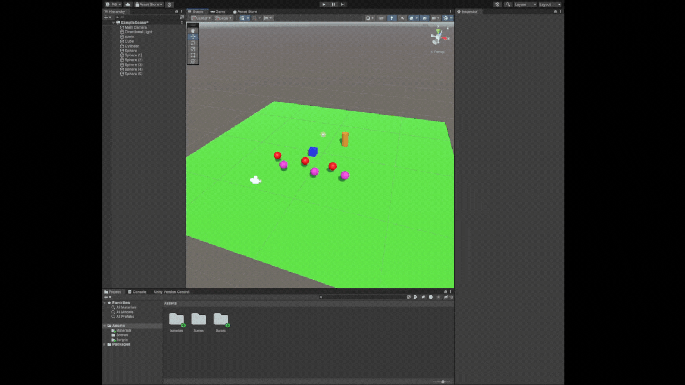
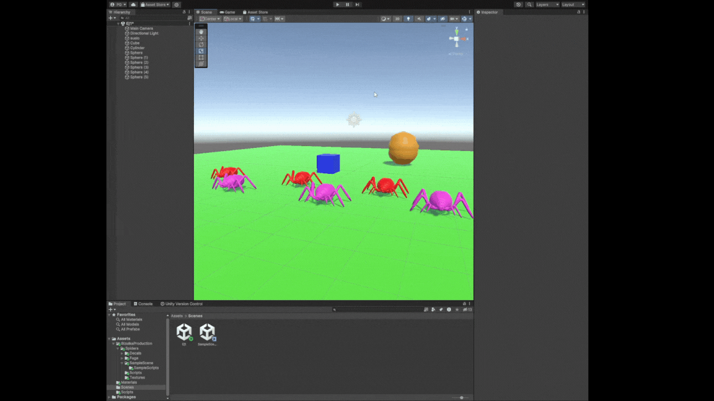
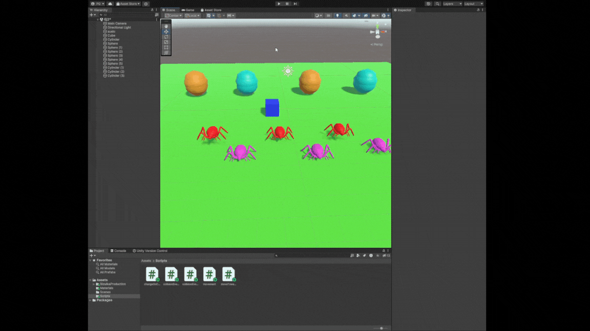
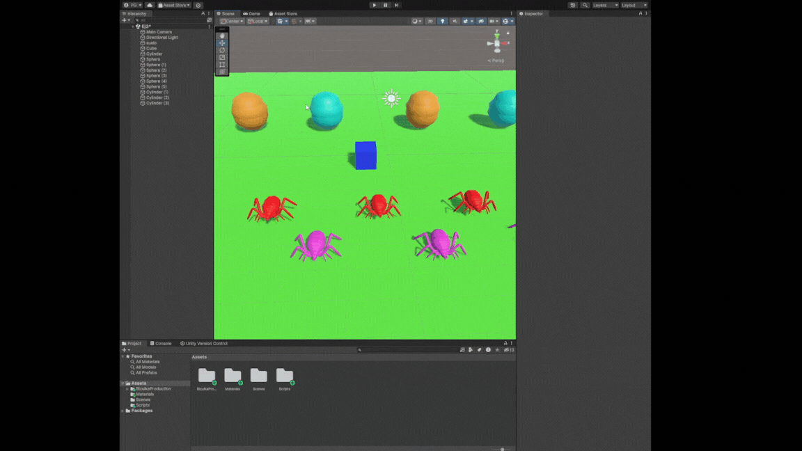
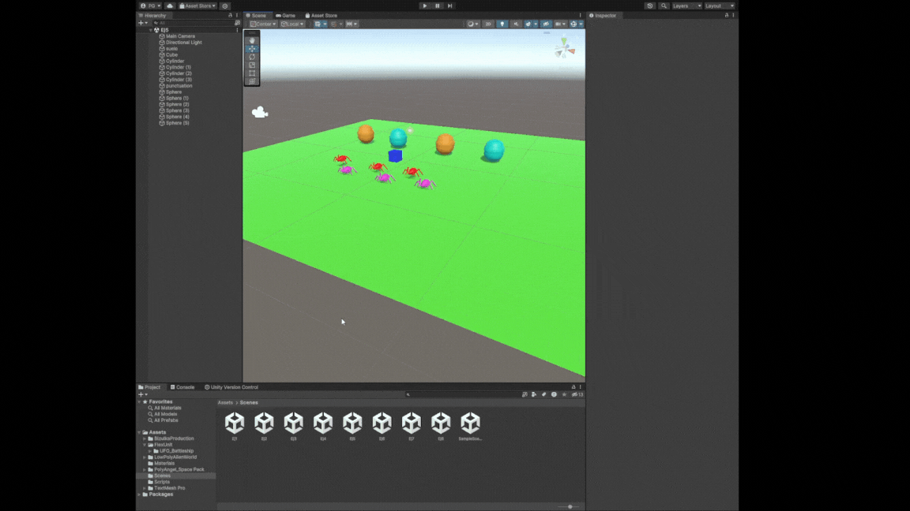
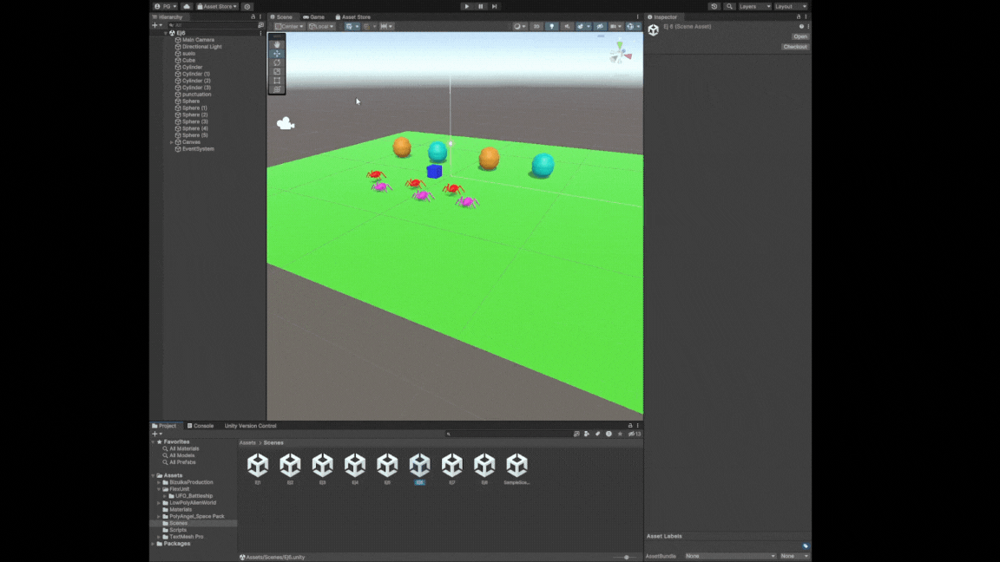
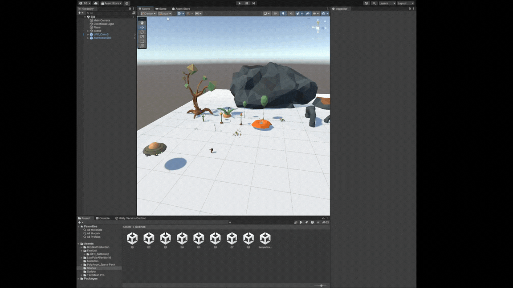

# p04-observador-unity
- Pablo Santana González alu0101480541@ull.edu.es
------------------------------------
# Ejercicio 1.

El cilindro manda un mensaje a todos sus subscriptores (las esferas) haciendo que estas se muevan hacia el objeto que les corresponda. Como podemos ver en el GIF, las esferas de tipo 2 se mueven al cilindro



Los scripts se han hecho genéricos para poder ser reusados entre todos los objetos de la escena (o futuros objetos en otras escenas). Desde el inspector de escenas podemos asignar el notificador a las esferas, así como el objeto al que queramos que se dirijan tras la colisión.

Este es el script para el desplazamiento del cubo:
```c#
public class movement : MonoBehaviour
{
    public float speed = 1f;
    // Start is called before the first frame update
    void Start()
    {   
    }
    // Update is called once per frame
    void Update()
    {
        float vertical_movement = Input.GetAxis("Vertical") * speed;
        float horizontal_movement = Input.GetAxis("Horizontal") * speed;
        Vector3 movement = new Vector3(horizontal_movement * Time.deltaTime, 0f, vertical_movement * Time.deltaTime);
        gameObject.transform.Translate(movement);
    }
}
```
Para que el cilindro actue como notificador de colisiones del mismo:
```c#
public class collisionEvent : MonoBehaviour
{
    public delegate void CollisionEventNotifier();
    public event CollisionEventNotifier OnCollision;
    // Start is called before the first frame update
    void Start()
    {
        
    }

    // Update is called once per frame
    void Update()
    {
        
    }

    void OnCollisionEnter(Collision other) {
        if (other.gameObject.name == "Cube") {
            OnCollision();
        }
    }
}
```
Para el movimiento de las esferas:
```c#
public class moveTowards : MonoBehaviour
{
    public GameObject target;
    public collisionEvent notifier;
    // Start is called before the first frame update
    void Start()
    {
        notifier.OnCollision += MoveTowards;
    }
    // Update is called once per frame
    void Update()
    {  
    }
    void MoveTowards() {
        this.transform.Translate((target.transform.position - this.transform.position).normalized, Space.World);
    }
}
```

# Ejercicio 2.

En el caso del ejercicio 2, se han seleccionado las esferas y sustituido su malla por la de las arañas del paquete de assets de Unity. También he tenido que reescalar las arañas para que fueran del tamaño de las esferas y ajustado su collider para que se asemejase más al modelo. El mismo proceso se ha seguido para el cilindro convertido a huevo.



# Ejercicio 3.

Se han realizado modificaciones sobre los scripts previos, así como la escena en sí. Se ha hecho que las arañas sean triggers. Ahora el cubo es quien notifica de la colisión y, para distinguir las colisiones de las arañas de un tipo con las otras, pasa el tag de la araña que ha disparado el evento. Entonces, las arañas comprueban que el disparador tienen su misma etiqueta y activan su movimiento si es necesario. En el caso de los huevos tipo 2, se hace una detección del trigger en este mismo objeto, ya que tiene menos sentido notificar al resto de huevos o arañas de que un solo elemento se va a cambiar de color. Si fuera para cambiar de color a todos los huevos del mismo tipo o las arañas del tipo que han tocado el huevo entonces si sería necesario aplicar el patrón observador.



Script de cambio de color:

```c#
public class changeOnCollision : MonoBehaviour
{
    public string[] tagsOfTargets;
    private Renderer objectRenderer;
    // Start is called before the first frame update
    void Start()
    {
        objectRenderer = this.GetComponent<Renderer>();
    }

    // Update is called once per frame
    void Update()
    {
        
    }

    void OnTriggerEnter(Collider other) {
        foreach (string tag in tagsOfTargets) {
            if (other.gameObject.tag == tag) {
                objectRenderer.material.color = Random.ColorHSV();
                break;
            }
        }
    }
}
```

Script de evento de colisión (pero con etiqueta):

```c#
public class collisionEventTag : MonoBehaviour
{
    public delegate void CollisionEventNotifierTag(string someTag);
    public event CollisionEventNotifierTag OnCollision;
    // Start is called before the first frame update
    void Start()
    {
        
    }

    // Update is called once per frame
    void Update()
    {
        
    }

    void OnTriggerEnter(Collider other) {
        OnCollision(other.gameObject.tag);
    }
}
```

Modificación en el script de movimiento del apartado anterior:
```c#
public class moveTowards : MonoBehaviour
{
    public GameObject target;
    public collisionEvent notifier;
    public collisionEventTag notifierTag;
    // Start is called before the first frame update
    void Start()
    {
        //notifier.OnCollision += MoveTowards;
        notifierTag.OnCollision += MoveTowardsWithTag;
    }

    // Update is called once per frame
    void Update()
    {
        
    }

    void MoveTowards() {
        // No rigidbody or kinematic rigidbodys
        this.transform.Translate((target.transform.position - this.transform.position).normalized, Space.World);

        // For non kinematic rigidbodys
        //this.GetComponent<Rigidbody>().Move((target.transform.position - this.transform.position).normalized, this.transform.rotation);
    }
    void MoveTowardsWithTag(string someTag) {
        if (this.tag == someTag) MoveTowards();
    }
}
```

# Ejercicio 4.

Similar al ejercicio anterior, pero en este caso se utilizan un script de rotancion y otro de teletransporte en vez de movimiento en una dirección.



```c#
public class teletransport : MonoBehaviour
{
    public GameObject target;
    public collisionEventTag notifier;
    // Start is called before the first frame update
    void Start()
    {
        notifier.OnCollision += Teletransport;
    }

    // Update is called once per frame
    void Update()
    {
        
    }

    void Teletransport(string tag) {
        if (tag == this.tag) {
            //this.GetComponent<Rigidbody>().Move(target.transform.position, this.transform.rotation);
            Vector3 pos = target.transform.position;
            pos.y = this.transform.position.y;
            pos.z -= 1; // Some space between egg and spider
            this.transform.Translate(pos - this.transform.position);
        }
    }

}
```

```c#
using System.Collections;
using System.Collections.Generic;
using UnityEngine;

public class rotateTowards : MonoBehaviour
{
    public GameObject target;
    public collisionEventTag notifier;
    // Start is called before the first frame update
    void Start()
    {
        notifier.OnCollision += Rotate;
    }

    // Update is called once per frame
    void Update()
    {
        
    }
    
    void Rotate(string tag) {
        if (tag == this.tag) {
            Vector3 pos = target.transform.position;
            //pos.z = -pos.z;
            this.transform.LookAt(pos);
        }
    }
}

```

# Ejercicio 5

En este caso cada huevo es un notificador, y cada cambio de puntuación se le manda a un objeto vacío que es el controlador de puntuación.



Script de los objetos a recolectar:

```c#
public class recolect : MonoBehaviour
{
    public int pointValue;
    public delegate void RecolectPoint(int point);
    public event RecolectPoint notifier;
    // Start is called before the first frame update
    void Start()
    {
    }

    // Update is called once per frame
    void Update()
    {
    }

    void OnTriggerEnter(Collider other) {
        this.GetComponent<Renderer>().enabled = false;
        notifier(pointValue);
    }
}
```

Script del controlador de puntuación:

```c#
public class punctuationController : MonoBehaviour
{
    public int punctuation;
    public recolect[] recolects;
    // Start is called before the first frame update
    void Start()
    {
        punctuation = 0;
        foreach (recolect r in recolects) {
            r.notifier += IncreasePunctuation;
        }
    }
    // Update is called once per frame
    void Update()
    {
        
    }

    void IncreasePunctuation(int points) {
        punctuation += points;
        Debug.Log("Punctuation: " + punctuation);
    } 
}
```

# Ejercicio 6.

Siguiendo un diseño parecido al ejercicio anterior, se usa un controlador para la puntuación pero esta vez incluye una referencia al componente de texto del objeto al que se asocia el script.



```c#
public class punctuationAndUI : MonoBehaviour
{
    public recolect[] recolects;
    public delegate void ReachedOneHundredPoints();
    // Ejercicio 7.
    public event ReachedOneHundredPoints reward;
    private TMP_Text text;
    private int punctuation;
    // Start is called before the first frame update
    void Start()
    {
        punctuation = 0;
        text = this.GetComponent<TMP_Text>();
        text.text = "Punctuation: " + punctuation;
        foreach (recolect r in recolects) {
            r.notifier += IncreasePunctuation;
        }
    }

    // Update is called once per frame
    void Update()
    {
        
    }

    void IncreasePunctuation(int points) {
        punctuation += points;
        text.text = "Punctuation: " + punctuation;
// Ejercicio 7.
        if (punctuation % 100 == 0) {
            reward();
        }
    } 
}
```

# Ejercicio 7.

Para dar la recompensa, se ha cambiado el script de puntuación (ver apartado anterior) para tener un evento que disparar cuando la puntuación sea múltiplo de 100. El evento es recibido por el script de movimiento del cubo y por el texto de recompensa de la UI.


Movimiento modificado:
```c#
public class movement : MonoBehaviour
{
    public float speed = 1f;
    public punctuationAndUI notifier;
    // Start is called before the first frame update
    void Start()
    {
        notifier.reward += SpeedUp;
    }

    // Update is called once per frame
    void Update()
    {
        float vertical_movement = Input.GetAxis("Vertical") * speed;
        float horizontal_movement = Input.GetAxis("Horizontal") * speed;
        Vector3 movement = new Vector3(horizontal_movement * Time.deltaTime, 0f, vertical_movement * Time.deltaTime);
        gameObject.transform.Translate(movement);
    }

    void SpeedUp() {
        speed *= 2f;
    }
}
```

Texto recompensa:
```c#
public class speedBoostText : MonoBehaviour
{
      public punctuationAndUI notifier;
    private TMP_Text text;
    private int boost;
    // Start is called before the first frame update
    void Start()
    {
        boost = 0;
        notifier.reward += IncreaseReward;
        text = this.GetComponent<TMP_Text>();
        text.text = "Speed boost activated " + boost + " times";
    }

    // Update is called once per frame
    void Update()
    {
        
    }

    void IncreaseReward() {
      text.text = "Speed boost activated " + ++boost + " times";
    } 
}
```

# Ejercicio 8.

Aún no hay clara una temática para el prototipo, por lo que he buscado algunos assets de una temática particular y creado una escena.



# Ejercicio 9.

En este caso ya había hecho el cubo físico (cinemático). Una alternativa sería reemplazar en el script de movimiento el update por un FixedUpdate y cambiar el Translate por un MovePosition (con los cambios de parámetros necesarios de este otro método).


